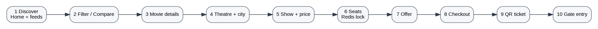
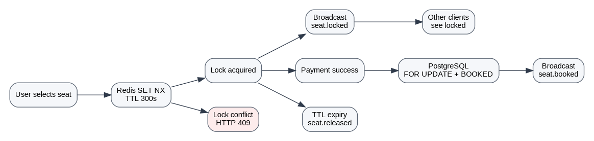
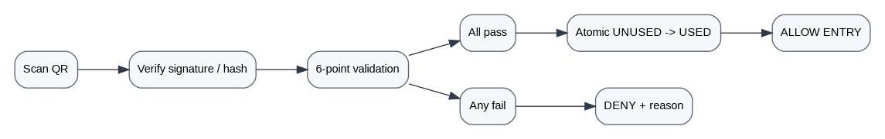
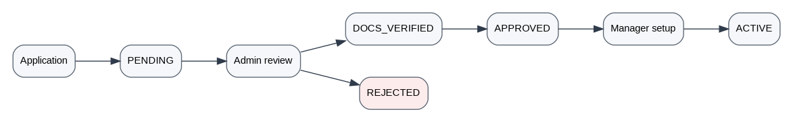

# CineVerse Application Flow v2.0

## 1. Global navigation model

The supplied product defines a ten-stage customer booking funnel: Discover -> Compare/Filters -> Movie -> Theatre -> Show -> Seats -> Offer -> Pay -> Ticket -> Enter. [Source: provided CineVerse specification]



## 2. Customer flow

```text
LANDING / HOME
   |
   +--> Select City -------------------------------+
   |                                               |
   +--> Search / Filter -> Movie Details           |
                                |                   |
                                +--> Theatre List --+
                                       |
                                       +--> Show List
                                              |
                                              +--> Seat Map
                                                     |
                                                     +--> Select seats
                                                     |      |
                                                     |      +--> Redis 5-min lock
                                                     |               |
                                                     |               +--> conflict -> choose again
                                                     |
                                                     +--> Checkout
                                                            |
                                                            +--> Apply coupon (optional)
                                                            |
                                                            +--> Mock Payment (P0)
                                                            |
                                                            +--> Confirm booking
                                                                   |
                                                                   +--> Generate QR ticket
                                                                          |
                                                                          +--> My Bookings
                                                                                 |
                                                                                 +--> Gate scan
```

### Customer screens - minimum P0

| Screen | Main actions |
|---|---|
| Home | Search, city, now showing, coming soon |
| Movie details | Metadata, trailer, rating summary, book |
| Theatre/show selection | Date, theatre, showtime, price |
| Seat map | Select/deselect seats, lock timer |
| Checkout | Summary, coupon, mock payment |
| Booking success | Booking ID, QR, download/share |
| My bookings | Upcoming/completed/cancelled |
| Profile | Basic account data and logout |

## 3. Seat locking flow



```text
User A selects C7
      |
      v
POST /shows/{id}/seats/lock
      |
      v
Redis SET key NX EX 300
   /               \
 OK                 nil
 |                   |
 v                   v
Seat LOCKED       HTTP 409
 |                   |
 v                   +--> UI refresh / choose another seat
Broadcast seat.locked
 |
v
5-minute countdown
 |
 +--> payment succeeds -> DB commit -> BOOKED -> broadcast
 |
 +--> user releases -> Redis DEL -> AVAILABLE -> broadcast
 |
 +--> TTL expires -> AVAILABLE -> broadcast
```

## 4. Booking flow

```text
Seat selection
   -> Redis hold
   -> Create INITIATED booking
   -> Calculate subtotal / fee / tax / discount
   -> Mock payment
   -> PROCESSING
      |      | +--> FAILED -> release locks -> booking FAILED/CANCELLED path
      |
      +--> SUCCESS -> PostgreSQL transaction
                         |
                         +--> SELECT seat rows FOR UPDATE
                         +--> assert seat state
                         +--> create booking_seats
                         +--> create payment success record
                         +--> mark show seats BOOKED
                         +--> commit
                         +--> delete Redis locks
                         +--> issue QR
                         +--> notification
```

## 5. Staff gate flow

The supplied specification requires a six-point validation chain: booking exists, correct theatre, correct screen, correct show/date, payment success, ticket unused. [Source: provided CineVerse specification]



```text
Staff login
   -> Today's show roster
   -> Open scanner
   -> Scan QR
   -> Verify signature/hash
   -> 6-point validation
      1. Booking exists?
      2. Theatre matches?
      3. Screen matches?
      4. Show/date matches?
      5. Payment acceptable?
      6. Ticket UNUSED?
      |
      +--> all pass -> atomic UNUSED -> USED -> GREEN / ALLOW ENTRY
      |
      +--> any fail -> RED / DENY + reason
```

## 6. Theatre manager flow

```text
Manager login
  |
  +--> Dashboard
  |
  +--> Theatre profile
  |
  +--> Screens
  |      +--> Create screen
  |      +--> Configure layout
  |      +--> Create seats
  |      +--> Set tiers / accessibility / broken state
  |
  +--> Shows
  |      +--> Select movie from master catalogue
  |      +--> Select screen
  |      +--> Date/time
  |      +--> Validate overlap
  |      +--> Set tier pricing
  |      +--> Publish
  |
  +--> Bookings
  |
  +--> Staff
  |
  +--> Analytics
```

The source manager scope includes theatre setup, screens, seat layout, show creation, pricing, analytics, QR-related operations, staff management, and reports. [Source: provided CineVerse specification]

## 7. Super Admin flow

```text
Admin login
 |
 +--> Dashboard
 +--> Users
 |     +--> Search / block / unblock
 |
 +--> Theatre approval
 |     +--> PENDING
 |     +--> docs review
 |     +--> APPROVED / REJECTED
 |     +--> ACTIVE
 |
 +--> Master movies
 |     +--> CRUD catalogue
 |
 +--> Coupons / policies
 |
 +--> Analytics / health
 |
 +--> Audit logs
```

## 8. Theatre onboarding flow



```text
Theatre application
      |
      v
PENDING REVIEW
      |
      v
Admin document review
   /         \
Reject      Approve
 |            |
v             v
REJECTED   DOCS_VERIFIED
              |
              v
           APPROVED
              |
              v
       Manager provisioned
              |
              v
     Screens + seats + shows
              |
              v
            ACTIVE
              |
              v
   Customer discovery can see shows
```

## 9. Payment deferral flow

```text
P0 checkout
   |
   +--> PaymentService interface
            |
            +--> MockPaymentAdapter (P0)
            |
            +--> Razorpay/Stripe/other adapter (P2 later)
```

This is the most important architecture decision for the current phase: the application is built against an interface, so real payment integration can be added without modifying booking and seat-lock logic.

## 10. Error flows

### Seat conflict
`409 SEAT_UNAVAILABLE` -> release local UI state -> refresh inventory -> let user choose again.

### Browser closed
Redis TTL expires -> seat is automatically released; no client cleanup is required.

### Duplicate confirmation request
Idempotency key returns existing booking result; no duplicate QR / booking record.

### Duplicate ticket scan
Atomic state transition fails -> return `TICKET_ALREADY_USED`.

### Cross-tenant access
Tenant middleware returns `403 TENANT_SCOPE_VIOLATION`.

## 11. Route map by frontend role

```text
/customer
  /home
  /movies/:movieId
  /shows/:showId/seats
  /checkout/:bookingId
  /booking/:bookingId
  /bookings
  /profile

/manager
  /dashboard
  /theatre
  /screens
  /shows
  /bookings
  /staff
  /analytics

/staff
  /today
  /scan
  /lookup

/admin
  /dashboard
  /users
  /theatres
  /movies
  /coupons
  /policies
  /audit
  /health
```
