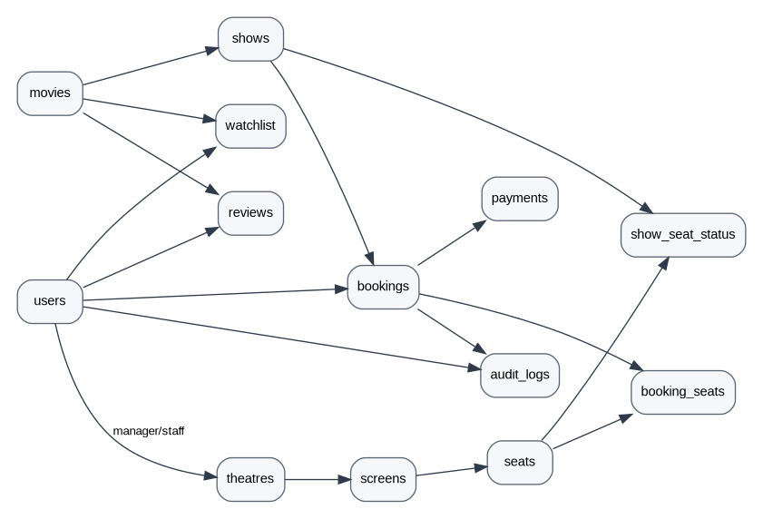

# CineVerse Backend and Database Schema v2.0

## 1. Purpose

This document defines the relational data model required to support the supplied CineVerse product and the prioritized current build. The provided baseline already defines PostgreSQL enums, theatres, users, screens, seats, movies, shows, show-seat inventory, concessions, coupons, bookings, booking seats, booking concessions, payments, reviews and audit logs. The implementation below retains that core and adds a small set of supporting tables for session security, theatre documents, watchlist and notifications.

## 2. Entity relationship overview



```text
users -------------------------- theatres
  |                                 |
  |                                 +---- screens ---- seats
  |                                             |
  |                                             +---- show_seat_status
  |
  +---- bookings ---- booking_seats ---- seats
  |        |
  |        +---- payments
  |        +---- booking_concessions ---- concession_items
  |        +---- coupons
  |
  +---- reviews ---- movies
  +---- watchlist --- movies
  +---- notifications
  +---- refresh_tokens

movies ---- shows ---- theatres / screens
                  |
                  +---- show_seat_status

super-admin actions ---- audit_logs
```

## 3. Core enums

```text
user_role_enum
  CUSTOMER
  THEATRE_MANAGER
  THEATRE_STAFF
  SUPER_ADMIN

theatre_status_enum
  PENDING
  DOCS_VERIFIED
  APPROVED
  REJECTED
  SUSPENDED
  ACTIVE

visual_format_enum
  2D, 3D, IMAX, 4DX, SCREEN_X

seat_tier_enum
  NORMAL, PREMIUM, RECLINER

seat_status_enum
  AVAILABLE, BOOKED, UNAVAILABLE

booking_status_enum
  INITIATED, PROCESSING, CONFIRMED, CANCELLED, EXPIRED

payment_status_enum
  INITIATED, PROCESSING, SUCCESS, FAILED, CANCELLED, REFUNDED

ticket_scan_status_enum
  UNUSED, USED, INVALIDATED
```

## 4. Table catalogue

| Table | Purpose | Priority |
|---|---|---|
| `roles_permissions` | Role-to-permission mapping | P0 |
| `users` | All four platform roles | P0 |
| `refresh_tokens` | Session/refresh token rotation | P0 |
| `theatres` | Multi-tenant cinema records | P0 |
| `theatre_documents` | KYC/legal onboarding files | P0 |
| `screens` | Physical auditoriums | P0 |
| `seats` | Physical seat definitions | P0 |
| `movies` | Master movie catalogue | P0 |
| `shows` | Movie scheduled on screen | P0 |
| `show_seat_status` | Per-show inventory state | P0 |
| `concession_items` | Optional theatre F&B | P1 |
| `coupons` | Global/local promotion rules | P0/P1 |
| `bookings` | Customer order header | P0 |
| `booking_seats` | Seat line items | P0 |
| `booking_concessions` | F&B line items | P1 |
| `payments` | Payment state and idempotency | P0 using mock adapter |
| `refunds` | Refund intent/status | P1/P2 |
| `reviews` | User movie reviews | P1 |
| `watchlist` | User saved movies | P1 |
| `notifications` | In-app events | P0 |
| `audit_logs` | Immutable sensitive-action trail | P0 |

## 5. Detailed tables

### 5.1 `users`

```text
id UUID PK
 theatre_id UUID FK -> theatres.id nullable for customers/admins
role user_role_enum
full_name
email UNIQUE
mobile_number UNIQUE nullable
password_hash nullable for OAuth-only account if added later
profile_photo_url
preferences JSONB
is_blocked
failed_login_attempts
last_login_at
created_at / updated_at
```

### 5.2 `theatres`

```text
id UUID PK
name
legal_entity_name
gst_number UNIQUE
contact_phone
contact_email
address_line
city
state
postal_code
latitude / longitude
amenities JSONB
status theatre_status_enum
created_at / updated_at
```

### 5.3 `screens`

```text
id UUID PK
theatre_id FK
screen_number
name
supported_formats visual_format_enum[]
sound_system
total_capacity
is_active
created_at / updated_at
UNIQUE(theatre_id, screen_number)
```

### 5.4 `seats`

```text
id UUID PK
screen_id FK
row_label
seat_number
tier seat_tier_enum
is_accessible
is_broken
grid_x / grid_y
created_at
UNIQUE(screen_id, row_label, seat_number)
```

### 5.5 `movies`

```text
id UUID PK
title
synopsis
duration_minutes
censor_certificate
original_language
supported_languages TEXT[]
genres TEXT[]
cast_members JSONB
director
poster_url
trailer_url
release_date
created_at / updated_at
```

### 5.6 `shows`

```text
id UUID PK
theatre_id FK
screen_id FK
movie_id FK
start_time
end_time
visual_format
language_version
base_tier_pricing JSONB
is_cancelled
created_at / updated_at
CHECK(end_time > start_time)
```

### 5.7 `show_seat_status`

This is the persistent inventory table used during final booking commit.

```text
id UUID PK
show_id FK
seat_id FK
status seat_status_enum
updated_at
UNIQUE(show_id, seat_id)
```

### 5.8 `bookings`

```text
id UUID PK
booking_reference UNIQUE
user_id FK
show_id FK
coupon_id FK nullable
subtotal_cents
convenience_fee_cents
tax_cents
discount_cents
total_amount_cents
status booking_status_enum
qr_payload_hash nullable until confirmed
qr_scan_status
scanned_at
scanned_by_staff_id
cancellation_fee_cents
refund_amount_cents
created_at / updated_at
```

### 5.9 `booking_seats`

```text
id UUID PK
booking_id FK
seat_id FK
allocated_price_cents
UNIQUE(booking_id, seat_id)
```

### 5.10 `payments`

```text
id UUID PK
booking_id FK
gateway_name
 gateway_transaction_id UNIQUE nullable before provider confirmation
gateway_order_id nullable for mock flow
amount_cents
currency
payment_method
status payment_status_enum
idempotency_key UNIQUE
gateway_response_payload JSONB
created_at / updated_at
```

For P0 the `gateway_name` can be `MOCK`. The real provider can later use the same schema.

## 6. Supporting tables added for implementation completeness

These are implementation additions, not changes to the product requirements.

### `refresh_tokens`

Stores hashed refresh tokens, device metadata, expiry and revocation time. This supports the source requirement for refresh-token rotation and multi-device session control.

### `theatre_documents`

Stores document metadata for theatre KYC: document type, file URL/key, verification status, reviewer, rejection reason and timestamps.

### `watchlist`

Simple composite key `(user_id, movie_id)` for saved movies.

### `notifications`

Stores in-app notification events with type, title, body, read state, user, related entity and created time.

### `refunds`

Stores refund intent and status so the cancellation workflow does not have to change when a real payment gateway is introduced.

## 7. Required indexes

```sql
CREATE INDEX idx_theatres_city_status ON theatres(city, status);
CREATE INDEX idx_movies_release_date ON movies(release_date);
CREATE INDEX idx_shows_theatre_start ON shows(theatre_id, start_time, is_cancelled);
CREATE INDEX idx_shows_movie_start ON shows(movie_id, start_time);
CREATE INDEX idx_show_seat_status ON show_seat_status(show_id, status);
CREATE INDEX idx_bookings_user_created ON bookings(user_id, created_at DESC);
CREATE INDEX idx_bookings_reference ON bookings(booking_reference);
CREATE INDEX idx_payments_booking ON payments(booking_id);
CREATE INDEX idx_notifications_user_created ON notifications(user_id, created_at DESC);
CREATE INDEX idx_audit_logs_actor_created ON audit_logs(actor_id, created_at DESC);
```

## 8. Redis key model

```text
lock:show:{showId}:seat:{seatId}                 -> {userId} TTL 300
lock:show:{showId}:user:{userId}:seat:{seatId}  -> optional ownership helper
cache:movie:{movieId}                            -> movie JSON
cache:shows:{movieId}:{city}:{date}             -> show list
session:{userId}:{sessionId}                     -> optional session metadata
```

## 9. Event model

```text
seat.locked
seat.released
seat.booked
booking.confirmed
booking.cancelled
ticket.used
notification.created
```

## 10. Booking consistency rules

1. A seat can only be `BOOKED` once per show.
2. Redis lock owner must be validated before voluntary release.
3. Final booking commit must lock database rows with `SELECT ... FOR UPDATE`.
4. Payment callbacks must be idempotent.
5. Ticket scan must perform an atomic `UNUSED -> USED` transition.
6. Manager and staff queries must always include `theatre_id` scope.
7. Audit entries are append-only.

## 11. Full SQL

The accompanying `CineVerse_DB_Schema_v2.sql` contains the executable PostgreSQL DDL for the schema above, including indexes, constraints and seed permission data.
